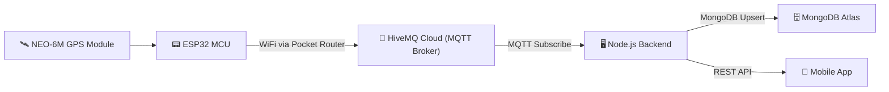
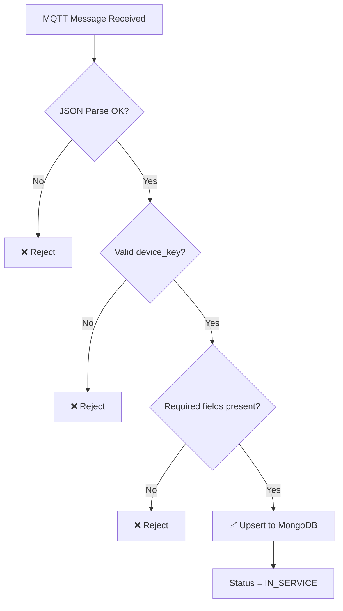
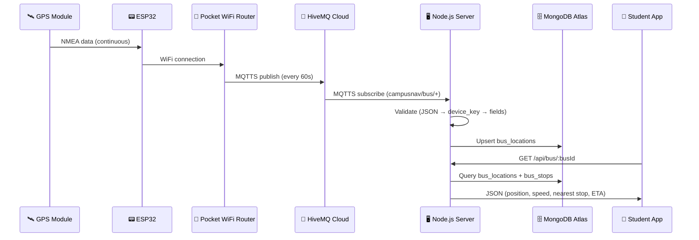

# 🚌 CampusNav — Bus Tracking System: Working Analysis

> **Author:** CampusNav Development Team  
> **Date:** March 9, 2026  
> **Version:** 1.0

---

## 1. System Overview

The CampusNav Bus Tracking System provides **real-time GPS-based tracking** of campus shuttle buses. Students can view live bus positions on an interactive map, see the nearest upcoming stop, and get estimated arrival times (ETA). The entire data pipeline — from GPS hardware on the bus to the student's mobile screen — operates over **MQTT**, using the **pocket WiFi routers** installed on each bus for internet connectivity.



---

## 2. Hardware Layer — On-Bus Equipment

Each campus bus is equipped with:

| Component | Role |
|---|---|
| **ESP32 Microcontroller** | Runs the firmware, manages WiFi + MQTT + GPS |
| **NEO-6M GPS Module** | Acquires satellite position (latitude, longitude, speed, satellite count) |
| **Pocket WiFi Router** | Provides 4G/LTE internet connectivity on the bus for the ESP32 to reach the cloud |

### How Data Is Sent to the Backend via MQTT Using Pocket WiFi Routers

1. **The pocket WiFi router** on each bus creates a local WiFi network (hotspot) using its cellular 4G/LTE data connection.
2. **The ESP32** connects to this pocket WiFi router on first boot using **WiFiManager** (a captive-portal library). Once credentials are saved, it auto-connects on subsequent boots — no manual reconfiguration is needed.
3. **The GPS module** (NEO-6M) continuously feeds NMEA sentences to the ESP32 via a hardware serial connection (Serial2, pins RX=16 / TX=17).
4. **Every 60 seconds**, the ESP32 reads the latest GPS fix, constructs a JSON payload, and **publishes it over MQTT** (with TLS encryption) to the cloud broker (**HiveMQ Cloud**) on the topic:
   ```
   campusnav/bus/BUS_01
   ```

### MQTT Payload Structure (ESP32 → Broker)

```json
{
  "bus_id":     "BUS_01",
  "latitude":    12.971234,
  "longitude":   77.594321,
  "speed":       35.2,
  "satellites":  8,
  "device_key":  "<secret_key>"
}
```

The `device_key` is a shared secret used for **message authentication** — the backend rejects any message with an invalid key.

---

## 3. MQTT Communication Layer

| Parameter | Value |
|---|---|
| **Protocol** | MQTTS (MQTT over TLS, port 8883) |
| **Broker** | HiveMQ Cloud |
| **Publish Topic** | `campusnav/bus/{bus_id}` |
| **Subscribe Topic (Backend)** | `campusnav/bus/+` (wildcard — all buses) |
| **QoS** | 1 (At least once delivery) |
| **Publish Interval** | Every 60 seconds |
| **Authentication** | Username/Password (MQTT) + `device_key` in payload |

### Why MQTT + Pocket WiFi?

- **MQTT** is a lightweight pub/sub protocol ideal for IoT devices with constrained bandwidth — perfect for an ESP32 on a moving bus.
- **Pocket WiFi routers** provide reliable, always-on 4G/LTE connectivity as the bus moves across campus, ensuring uninterrupted data flow without depending on campus WiFi infrastructure.
- **TLS encryption** (port 8883) ensures all GPS data is transmitted securely.
- **Auto-reconnect** logic on both the ESP32 firmware and the backend subscriber ensures resilience against temporary network drops.

---

## 4. Backend Processing Pipeline

The **Node.js backend** subscribes to `campusnav/bus/+` via a dedicated MQTT client (`busMqttService.js`). When a message arrives, it goes through a **4-stage validation pipeline**:

### Stage 1 — JSON Parse
The raw MQTT buffer is parsed into a JSON object. Malformed payloads are rejected.

### Stage 2 — Device Key Validation
The `device_key` in the payload must match the server-side `BUS_DEVICE_KEY` environment variable. This prevents unauthorized or spoofed messages from being accepted.

### Stage 3 — Field Validation
Required fields (`bus_id`, `latitude`, `longitude`) must be present. Coordinates must be within valid geographic ranges (lat: ±90°, lng: ±180°). The `bus_id` must be a string. Invalid data is rejected.

### Stage 4 — Database Upsert
Validated data is upserted into MongoDB Atlas (`bus_locations` collection). The bus status is set to `IN_SERVICE`, and the `last_updated` timestamp is refreshed.



---

## 5. Bus Status & Timeout Detection

| Status | Meaning |
|---|---|
| `IN_SERVICE` | Bus is actively sending GPS data — currently on route |
| `NOT_IN_SERVICE` | Bus has stopped transmitting for > 120 seconds — assumed parked or off |

A **timeout checker** runs every 30 seconds on the backend. Any bus whose `last_updated` timestamp is older than **120 seconds** is automatically marked as `NOT_IN_SERVICE`. This ensures the map accurately reflects only buses that are actively running.

---

## 6. ETA & Nearest Stop Calculation

The backend provides a unified endpoint (`GET /api/bus/:busId`) that returns:

- **Live GPS coordinates** of the bus
- **Current speed** (km/h)
- **Nearest bus stop** (computed via Haversine great-circle distance against all stops in `bus_stops` collection)
- **ETA in minutes** to the nearest stop (distance ÷ speed)
- **Distance** to the nearest stop in kilometers

### ETA Logic

| Condition | Result |
|---|---|
| Speed > 5 km/h | ETA = `distance_km / speed * 60` minutes |
| Speed ≤ 5 km/h | `"Arriving"` |
| Speed ≤ 1 km/h | `"Stopped"` |
| Bus is `NOT_IN_SERVICE` | `"Bus Not In Service"` — no ETA computed |

### How ETA Is Displayed on the Mobile App

On the **Bus Map Screen**, when a bus is `IN_SERVICE`, the info panel at the bottom shows:

1. **Speed** — e.g., `35.2 km/h` or `Stopped`
2. **Satellites** — number of GPS satellites for fix quality
3. **Last Updated** — relative timestamp (e.g., `12s ago`, `2m ago`)
4. **ETA Card** — shows the nearest stop name, relative ETA (e.g., `5 min`), and distance (e.g., `1.2 km away`)
5. **Coordinates + IST timestamp** — raw lat/lng and Indian Standard Time

### Estimated Arrival Time

In addition to the relative ETA (e.g., `5 min`), the system computes an **estimated arrival clock time** by adding the ETA minutes to the current time. For example:

| Current Time | ETA | Estimated Arrival |
|---|---|---|
| 10:30 AM | 5 min | **10:35 AM** |
| 2:15 PM | 12 min | **2:27 PM** |
| 8:00 AM | Arriving | **Now** |

> **Note (Known Issue):** The current mobile app implementation displays only the relative ETA (`X min`) and does not yet show the computed estimated arrival clock time (e.g., "10:35 AM IST"). This is a planned enhancement — the backend already provides `eta_minutes` which can be used to calculate `currentTime + eta_minutes` on the client side to display the arrival time.

---

## 7. REST API Endpoints (Bus Tracking)

| Endpoint | Method | Description |
|---|---|---|
| `/api/bus/all` | GET | Returns all buses with status, coordinates, and IST timestamp |
| `/api/bus/status/:id` | GET | Returns a single bus by `bus_id` |
| `/api/bus/eta/:id?destLat=x&destLng=y` | GET | Computes ETA from bus to a custom destination |
| `/api/bus/:busId` | GET | Unified: location + nearest stop + ETA |

---

## 8. MongoDB Data Model

### `bus_locations` Collection

| Field | Type | Description |
|---|---|---|
| `bus_id` | String (unique, indexed) | Identifier for the bus (e.g., `BUS_01`) |
| `latitude` | Number | Current GPS latitude |
| `longitude` | Number | Current GPS longitude |
| `speed` | Number | Current speed in km/h |
| `satellites` | Number | Number of GPS satellites in use |
| `status` | String (enum) | `IN_SERVICE` or `NOT_IN_SERVICE` |
| `last_updated` | Date | Timestamp of last received GPS data |

### `bus_stops` Collection

| Field | Type | Description |
|---|---|---|
| `bus_id` | String (indexed) | Which bus route this stop belongs to |
| `stop_name` | String | Human-readable stop name |
| `latitude` | Number | Stop latitude |
| `longitude` | Number | Stop longitude |

---

## 9. Faculty Privacy Feature (Latest Addition)

### Overview

A recently added feature gives **faculty members control over their privacy**. Faculty can log in to the system and set their availability status, which directly affects whether students can see their real-time BLE-tracked location.

### Faculty Status Options

| Status Value | Displayed to Students As | Location Visible? |
|---|---|---|
| `available` | ✅ Available | Yes — room shown |
| `busy` | 🔴 Busy | Yes — room shown |
| `not_available` | ⛔ Not Available | **No — location is completely hidden** |

> **Note:** When a faculty member sets their status to **"Not Available"**, their live BLE-tracked room location is **completely hidden** from students. The API returns `room: null` and `hidden: true`. Students only see the status as **"Not Available"** — no location information is disclosed.

### How It Works

1. **Faculty Login (Optional)**  
   Faculty members who wish to control their privacy can log in via `POST /api/faculty/login` using a username and bcrypt-hashed password. A **JWT token** (valid for 24 hours) is issued on success.

2. **Setting Status**  
   Authenticated faculty can update their status via `POST /api/faculty/status` (JWT-protected):
   - `available` — visible and trackable
   - `busy` — visible but flagged as busy
   - `not_available` — **location hidden**, students see "Not Available"

3. **Privacy Enforcement (Backend)**  
   When a student queries a faculty member's location (`GET /api/faculty/location/:id` or `GET /api/faculty/:id/status`), the backend checks the faculty's status:
   - If status is `not_available` → response returns `room: null`, `hidden: true`
   - Otherwise → real BLE-tracked room is returned normally

4. **Auto-Expiry**  
   The **Status Timer Service** automatically resets any faculty in "Not Available" status back to `available` after **5 minutes**, preventing permanent location hiding. This runs as a periodic check every 60 seconds.

5. **Logout Reset**  
   When a faculty member logs out (`POST /api/faculty/logout`), their status is automatically reset to `available`, restoring normal tracking.

### Privacy API Endpoints

| Endpoint | Method | Auth | Description |
|---|---|---|---|
| `/api/faculty/login` | POST | None | Faculty login — returns JWT |
| `/api/faculty/status` | POST | JWT | Set status (available / busy / not_available) |
| `/api/faculty/logout` | POST | JWT | Logout — resets status to available |
| `/api/faculty/:id/status` | GET | None | Public — view faculty status (privacy applied) |
| `/api/faculty/location/:id` | GET | None | Public — view faculty location (privacy applied) |

---

## 10. End-to-End Data Flow Summary



---

## 11. Key Security Measures

| Layer | Mechanism |
|---|---|
| **MQTT Transport** | TLS encryption (MQTTS, port 8883) |
| **MQTT Auth** | Username/Password on HiveMQ Cloud |
| **Message Auth** | `device_key` validated on every GPS message |
| **Faculty Auth** | JWT tokens (24h expiry) with bcrypt-hashed passwords |
| **Faculty Privacy** | Server-side enforcement — `not_available` hides location at API level |
| **Input Validation** | 4-stage pipeline rejects malformed/invalid data |

---

## 12. Summary

The CampusNav Bus Tracking system is a fully functional, end-to-end IoT pipeline that:

✅ Uses **ESP32 + GPS hardware** on each bus to acquire real-time position  
✅ Transmits data via **MQTT over TLS** using **pocket WiFi routers** installed on the buses  
✅ Processes and validates data through a **4-stage backend pipeline**  
✅ Stores live positions in **MongoDB Atlas** with automatic timeout detection  
✅ Computes **nearest stop and ETA** using Haversine distance  
✅ Exposes clean **REST APIs** for the mobile app  
✅ Includes a **faculty privacy feature** allowing staff to mark themselves as **"Not Available"**, completely hiding their BLE-tracked location from students, with auto-expiry after 5 minutes
